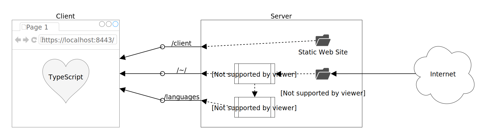

# Typescript Presentation

This project is a slide show that introduces the TypeScript programming language and was presented at the NodeMN meetup group on December 12, 2017.

## Introduction

This project is implemented as a web-based application using TypeScript for both the browser-based client and Node.js/Express-based server. The high-level architecture is as follows:

<!-- TODO: Write some Getting Started instructions.
## Getting Started
1. Install [Node.js](https://nodejs.org/) v8.9.1 or higher (`console.group()` and `console.groupEnd()` are the requirements that push this project to such a recent version).
1. Clone [this git repository](https://github.com/robertbullen/typescript-presentation.git).
1. Open a command prompt and navigate to the directory in which you cloned the repository.
1. Execute `npm install`.
1. Execute `npm start`.
-->
